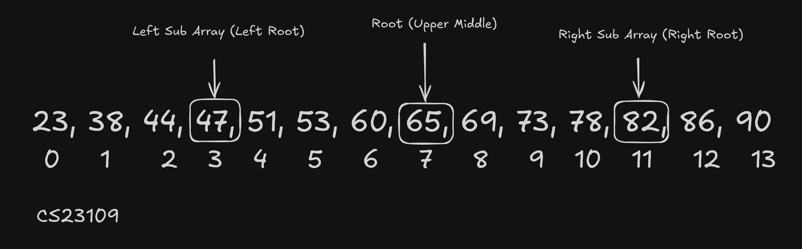
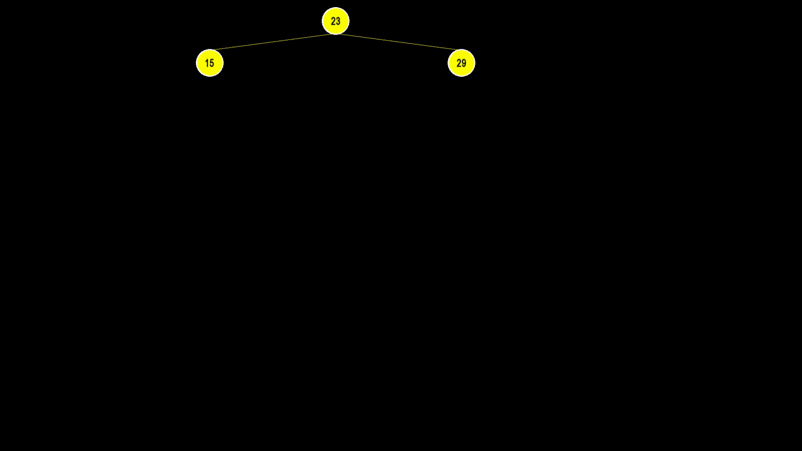
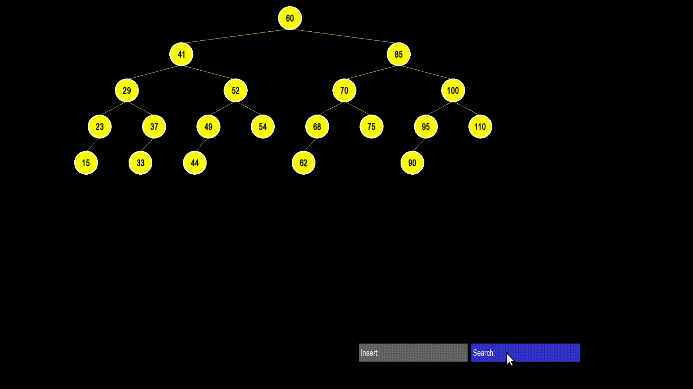
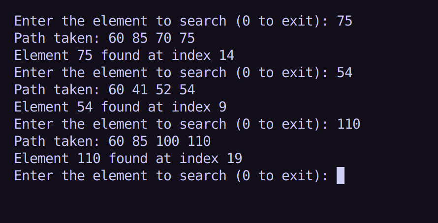
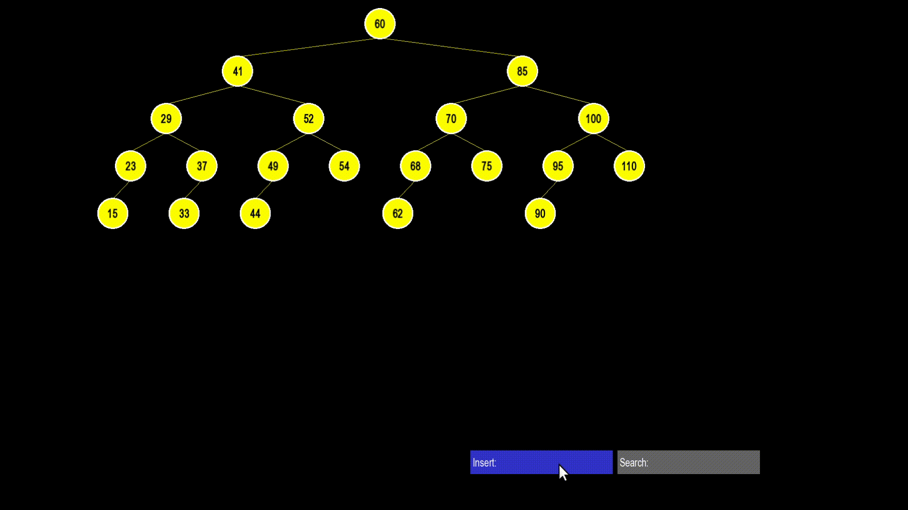

# Verbatim Binary Search Special AVL Tree - Documentation

## The Abstract Idea (Algorithm’s Intuitive Logic)

Initially, I thought of an algorithm based on how a traditional AVL tree balances itself using right, left, left-right, and right-left rotations. My goal was to create a special AVL tree that mimics a binary search process verbatim. To achieve this, I implemented a condition ensuring that the tree balances itself in such a way that when searching for an element, the path followed in this tree would be exactly the same as in a typical binary search on a sorted array.

The abstract idea was to take a sorted array and construct the AVL tree by selecting the middle (or upper-middle) element as the root node. Then, I would recursively apply the same logic: selecting the middle (or upper-middle) element of the left subarray as the left child and the middle (or upper-middle) element of the right subarray as the right child.



While the logic for choosing root and child nodes was correct, I faced a problem when trying to balance the tree using local rotations. My goal was to create a **"Verbatim Binary Search Special AVL Tree,"** but local rotations failed in certain edge cases. Specifically, if the program encountered difficulty determining the correct median of the array, it would get stuck in an infinite loop, oscillating between elements without settling on the correct median.

This made me realize that while the idea of optimizing the tree with minimal rotations sounded good on paper, it was not practical due to these edge cases. So, I went back to the drawing board and came up with a much simpler but naive solution. While not optimal in terms of time complexity, it worked reliably.

In this new approach, I completely discarded rotations. Instead, every time a new element was inserted, the program would reconstruct the entire tree from scratch using the given sorted array. The logic for selecting root nodes remained the same, but the balancing mechanism was entirely different. This method ensured that the tree was always perfectly balanced, maintaining the desired binary search path structure, but at the cost of increased time and space complexity.

With my initial approach, I was aiming for a time complexity of **O(log n),** but with this new approach, the average complexity is **O(n)** since the tree is rebuilt on every insertion. It’s not the most efficient solution, but at least it works in most cases.

## The Superiority of Local Rotations

The logic behind local rotations in AVL trees is fundamentally more optimized than the current approach because it preserves balance dynamically without requiring a full reconstruction of the tree. In a standard AVL tree, rotations ensure that the tree maintains a logarithmic height of O(log n), allowing insertions and deletions to be handled in O(log n) time as well. This localized restructuring prevents unnecessary overhead and minimizes redundant operations, making it far more efficient in terms of time complexity compared to a full rebuild.

However, my current approach, while more intuitive and guaranteeing a perfectly balanced tree, suffers from significant performance drawbacks. The requirement to rebuild the tree from scratch on every insertion or deletion increases both time and space complexity. Despite being suboptimal in efficiency, it is a more reliable and predictable approach that avoids the pitfalls of edge cases encountered with rotation-based balancing.

---

## Implementation in Computer Code

### Building a Balanced Tree

Instead of performing rotations like a standard AVL tree, this implementation rebuilds the entire tree from a sorted array every time a new element is inserted or removed.

```cpp
AVLNode<T>* buildBalancedTree(int start, int end) {
    if (start > end) {
        return nullptr;
    }

    int mid = (start + end + 1) / 2; // Pick the "upper" middle index
    AVLNode<T>* node = new AVLNode<T>(sortedElements[mid]);

    node->left  = buildBalancedTree(start, mid - 1);
    node->right = buildBalancedTree(mid + 1, end);

    int lh = height(node->left);
    int rh = height(node->right);
    node->height = 1 + std::max(lh, rh);

    return node;
}
```

### What’s Happening Here?
- The middle element of the sorted array becomes the root.
- The left half recursively becomes the left subtree.
- The right half recursively becomes the right subtree.
- The tree is always perfectly balanced.

#### Why Use `mid = (start + end + 1) / 2` Instead of `mid = (start + end) / 2`?
This ensures that when there’s an even number of elements, the tree picks the upper middle element as root. This prevents unbalanced trees.

---

### Insert Operation

```cpp
AVLNode<T>* insertRebuild(T key) {
    auto it = std::lower_bound(sortedElements.begin(), sortedElements.end(), key);
    if (it == sortedElements.end() || *it != key) {
        sortedElements.insert(it, key);
    }
    return buildBalancedTree(0, (int)sortedElements.size() - 1);
}
```

#### Step-by-Step Explanation:
1. Find the correct position to insert `key` in `sortedElements` (maintains sorted order).
2. Insert `key` if it's not already present.
3. Rebuild the tree from scratch.

#### Time Complexity:
- Searching for the position is **O(log N)** (since `std::lower_bound` uses binary search).
- Inserting into a vector is **O(N)** in the worst case (due to shifting).
- Rebuilding a balanced tree is **O(N).**
- **Overall Complexity:** **O(N) per insert.**

---

### Delete Operation

```cpp
AVLNode<T>* deleteRebuild(T key) {
    auto it = std::lower_bound(sortedElements.begin(), sortedElements.end(), key);
    if (it != sortedElements.end() && *it == key) {
        sortedElements.erase(it);
    }
    if (sortedElements.empty()) {
        return nullptr;
    }
    return buildBalancedTree(0, (int)sortedElements.size() - 1);
}
```

#### Step-by-Step Explanation:
1. Find the `key` in `sortedElements` using binary search.
2. If found, erase it.
3. Rebuild the tree from scratch.

#### Time Complexity: **O(N) per delete** (since it rebuilds the tree).

---

### Searching for an Element

```cpp
bool searchBST(AVLNode<T>* node, T key) {
    if (!node) {
        return false;
    }
    if (node->key == key) {
        return true;
    }
    if (key < node->key) {
        return searchBST(node->left, key);
    } else {
        return searchBST(node->right);
    }
}
```

#### Binary Search in the Tree:
- Start from the root.
- Move left if the key is smaller.
- Move right if the key is larger.
- If a match is found, return **true**; otherwise, return **false.**
- **Time Complexity:** **O(log N) for a balanced tree.**

---

### Path Tracking for Search Highlighting

```cpp
vector<AVLNode<T>*> getSearchPath(T key) {
    vector<AVLNode<T>*> path;
    AVLNode<T>* current = root;
    while (current) {
        path.push_back(current);
        if (current->key == key) {
            break;
        }
        else if (key < current->key) {
            current = current->left;
        }
        else {
            current = current->right;
        }
    }
    return path;
}
```

- This function tracks the nodes visited during a search.
- The path is useful for visualization, allowing highlighting in SFML.

---

## Animation and Visualization

For the animation and visualization of my simulator, I used the **SFML library in C++**, which is a well-known graphics library for C++. I also utilized keyboard input and mouse detection functionalities from SFML to allow users to insert a new element into the tree and visualize it on the screen.



Users can input an element to search for in the tree, and the program will highlight the path taken to find it. This helped me confirm that the search path in my special AVL tree matches exactly with the path followed in a binary search on a sorted array when looking for the same element.



To verify this, I implemented a simple C++ binary search program that prints the path to a searched element. The results for elements **75, 54, and 110** confirm that the special AVL tree follows the exact same path as binary search in an array.



Lastly, the visualizer also shows the **real-time insertion of new elements** and how the structure adjusts itself to maintain balance.



---

### **DAA - Assignment 02 - BSCS23109**